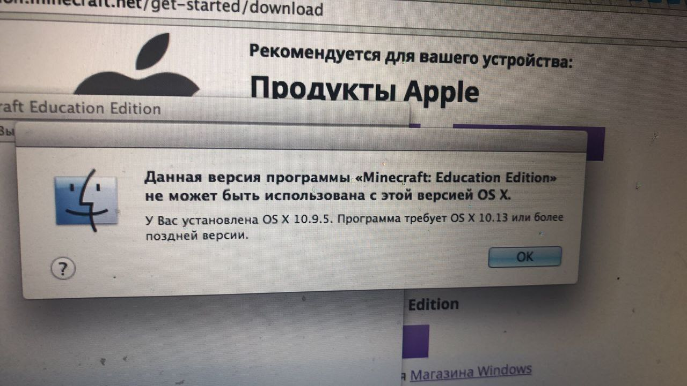
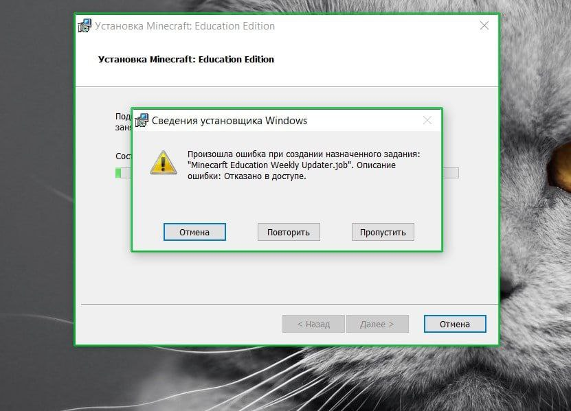
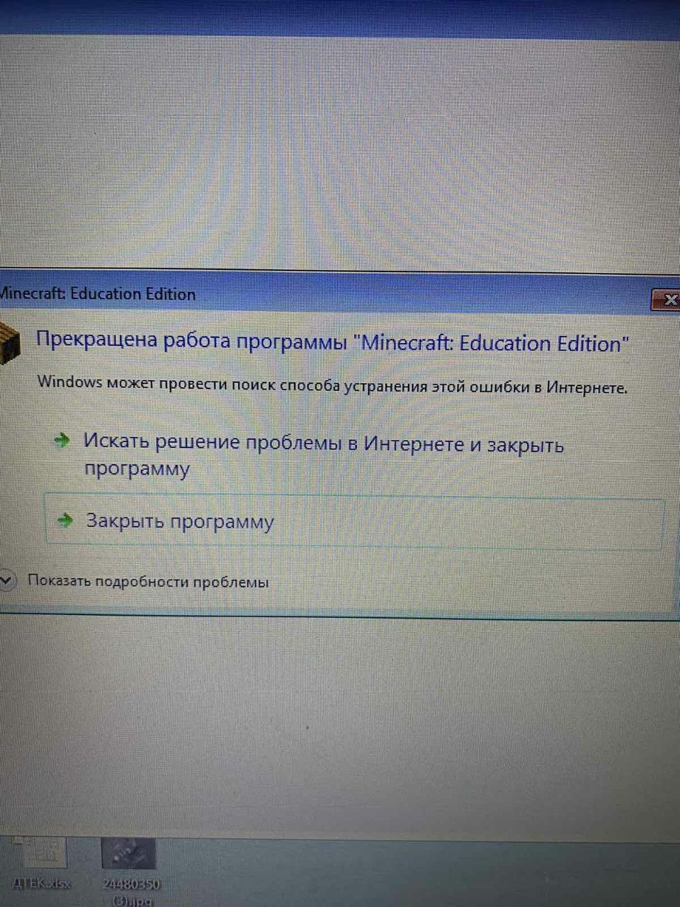
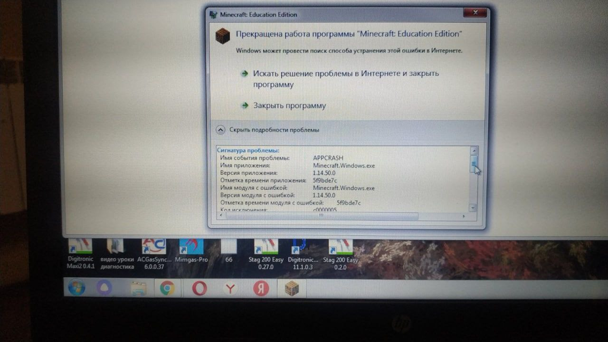
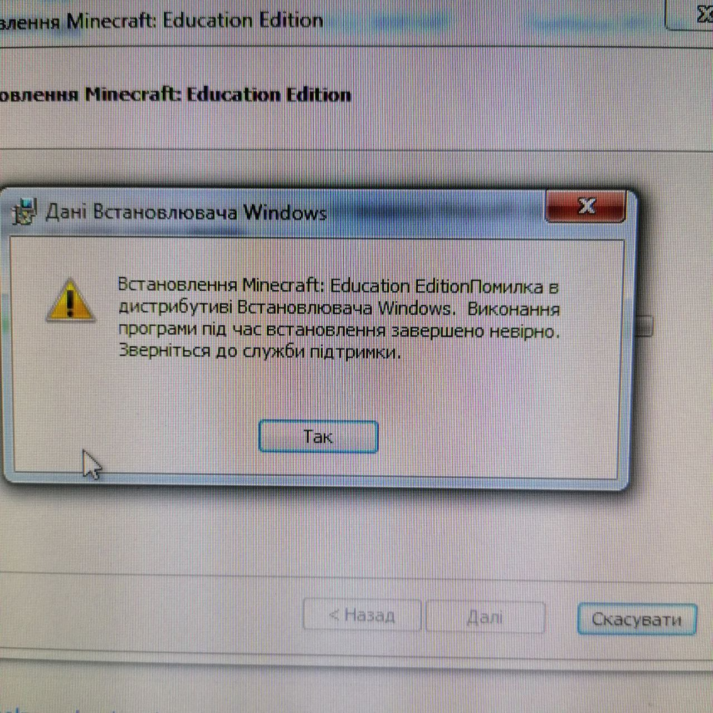

# Установка программного обеспечения Minecraft Education
## Рекомендуемые требования:  
Для комфортной работы в Minecraft Education рекомендуется следующие системные требования компьютера:
* Процессор с тактовой частотой выше 2ГГц
* 8 Гб ОЗУ
* DirectX 9 с WDDM 1.0 (ссылка на скачивание)
* PC Windows 10 (Windows 7 - не всегда корректно устанавливает Minecraft); для Mac - OS X 10.13

При установки Minecraft Education могут возникать проблемы, ниже - мы перечислили основные причны таких проблем:
## Частые ошибки и возможные пути их устранения:
### Устаревшая версия операционной системы    
  
Необходимо обновить версию операционную систему.

### Ограничения доступа
    
Необходимо запустить установку программы Minecraft Education "от имени администратора".

### Различные ошибки в операционной системе Windows
      
      
      
Переустановить операционную систему на ту же Windows 7 (не нажежно) или установить операционную систему Windows 10 (в 90% Minecraft Education запускается без ошибок)

